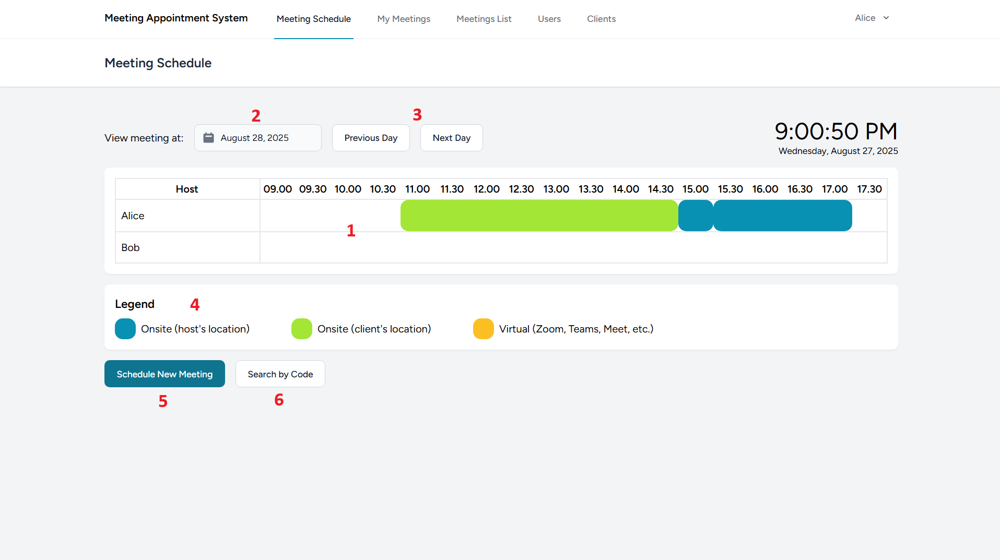

A simple meeting scheduler app built using Laravel 10 and Laravel Breeze starter kit with React. A revamp version currently under development can be found here: https://github.com/paundra0217/meeting-scheduler

## Disclaimer
Please note that this application is written under an older version of Laravel (10), and was originally developed without GitHub or any version control. It was later uploaded here to showcase it as part of my work. Active development stopped around February 2024, and the repository is only maintained for display/reference purposes.

## Prerequisites
To run this application locally, make sure you have the following installed:
- PHP 8.1 - 8.3
- Composer
- Git
- MySQL/PostgreSQL (or other Database that have first-party support from Laravel. [Documentation](https://laravel.com/docs/10.x/database))
- Node.js & npm/yarn (for frontend assets)
- Visual Studio Code (or any other code editor)

It is recommended to use XAMPP or Laragon to run this application in development enviroment, as both software bundles PHP and MySQL. Make sure to have the correct PHP version installed in either XAMPP or Laragon.

For your information, this was developed on Windows 11 machine with XAMPP (PHP, Apache, and MySQL)

## Setting Up the Application
1. Clone this repository and navigate to the folder
   ```bash
   git clone https://github.com/paundra0217/meeting-app.git
   cd path/to/meeting-app
   ```
2. Install PHP dependencies  
   ```bash
   composer install
   ```
3. Copy the enviroment file
   ```bash
   cp .env.example .env
   ```
   Then update the .env file with your local database credentials
   ```env
   DB_CONNECTION=mysql
   DB_HOST=127.0.0.1
   DB_PORT=3306
   DB_DATABASE=meeting_app
   DB_USERNAME=root
   DB_PASSWORD=root
   ```
   You will also need to set the timezone to the current timezone of your local machine as an [IANA zone format](https://timeapi.io/documentation/iana-timezones) so it'll display the correct time and functions correctly in the application. This is important because of the design of the application, where this is a personal project and assuming that the target audience or users in only on one region of the timezone.
   ```env
   APP_TIMEZONE=Asia/Jakarta
   ```
4. Generate Application Key
   ```
   php artisan key:generate
   ```
5. Run Database Migrations
   ```
   php artisan migrate
   ```

## Running the Application
1. Start the Database server. If you are using XAMPP or Laragon, make sure to start Apache server and MySQL from the control panel.
2. Start the Laravel backend
   ```bash
   php artisan serve
   ```
3. On separate terminal, start the frontend (React + Vite)
   ```bash
   npm run dev
   ```
4. In your browser and by default, navigate to http://127.0.0.1:8000.

## Using the Application
Below are the rough guide on how to use the application.
### First time Users
For first time users, you will see Registration page. Fill out your credentials, then click "Start Using". When done, you should end up in the Meeting Schedule page. If not, login with the same credentials when you register for the first time, then click "Login".
### Dashboard / Meeting Schedule
This is what the meeting schedule or dashboard looks like

</img>

The numbers means:
1. The timeline or schedule, where that user will have a meeting.
2. Date input, to filter the schedule based on date.
3. Button shortcut to filter next or previous date of the schedule.
4. The color legend of the meeting location.
5. Button for scheduling new meeting.
6. Button for finding a scheduled meeting by code.

In the Navbar:
- Meeting Schedule: Page for viewing the meeting schedule by timeline, filtered by date.
- My Meetings: Page for viewing the current and upcoming meetings for the application user.
- Meetings List: [Admins Only] Page for viewing all scheduled meetings, including cancelled one.
- Users: [Admins Only] Page for viewing registered users of the application.
- Clients: [Admins Only] Page for viewing registered clients of the application. (Application can only be accessed by the users, not client)

### Adding Users
Below are the steps on how to add Users

1. Make sure to log in as Admin
2. Go to Users page
3. Click "Add User"
4. Fill the credentials
5. Click "Add"

User will be notified and sent the password by email, which is in form of Logs, where you can find it in `logs/laravel.log`.

### Adding Clients
Steps are similar to Adding a User:

1. Make sure to log in as Admin
2. Go to Clients page
3. Click "Add Client"
4. Fill the credentials
5. Click "Add"

### Scheduling meetings
Before starting to schedule new meetings, make sure you have the clients registered. If done, below are the steps:

1. Make sure to log in as Admin
2. Go to Meeting Schedule page
3. Click "Schedule New Meeting"
4. Enter the desired information.
5. Click "Schedule"

Both User and Client will be notified via email, which again is in form of Logs, where you can find it in `logs/laravel.log`.

### Viewing Meetings
Viewing meetings can be done in 3 pages:
- On Meeting Schedule page: where you can find meetings in a form of timeline on a specific date, and can be changed to the date you want to search in.
- On My Meetings page: where you can find meeting that was scheduled between the user of the application and the client.
- On Meetings List page: where as an admin can view all meetings that we're scheduled in the application, including the cancelled ones.

You can find more information about the meeting by clicking the colored box in the timeline at the same page, or in "My Meetings" if the meetings was yours, or "Meetings List" if logged in as an Admin. For faster finding, go to the "Meetings Schedule" page, click the "Search by Code" button, and then enter the meeting code, that was received by either user or client via email.

### Editing/Cancelling Meetings
Find the meeting you want, either entering code on "Search by Code" button in "Meetings Schedule" page, or either "My Meetings" and "Meetings List" by clicking "Details" beside the meeting. After that, a new page will pop up, containing the detailed information about the meeting. If you want to edit the meeting, click "Edit Meeting Schedule" and edit the information, or if you want to cancel, click "Cancel Meeting" and input the cancellation reason.

### Editing/Deleting Users/Client
The procedure for editing or deleting users and clients are similar. You can go to Users or Clients page, click "Edit" beside the user or client you want to edit, and edit the user or client, or click "Delete" to delete the user or client.

## 📂Files description
```
├── meeting-app
   ├── app                                
      ├── Http                                
         ├── Controllers               # Contains the Controllers of the application, which contains the main backend logic.
         ├── ...
      ├── Models                       # Contains the Models of the application, which is the data form.
      ├── Notifications                # Contains the Notifications, for notifying users and clients about upcoming meetings, etc.
   ├── ...
   ├── database                                
      ├── migrations                   # Contains the database table configuration for database migration.      
   ├── ...
   ├── docs                            # Contains the assets for writing documentation.
   ├── resources
      ├── js                           # Contains the frontend code, which is React.
   ├── routes                          # Contains the predefined routes of the application.
      
```
